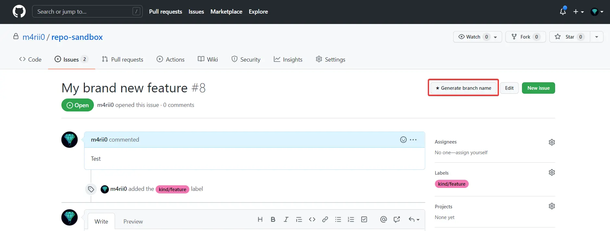

# GitHub Helper


Improve your productivity by using GitHub Helper.

## Features
### Branch name composition

It will generate a branch name based on the next pattern:
```
<issue-type>/GH-<issue-number>-<issue-title>
```
The issue type will be obtained from the issue labels with the prefix `kind/`, i.e. `kind/feature`, `kind/documentation`.
Right now there is an exception for the `kind/bug` label, which will be replaced for `bugfix`.

## Installation

- You need to install Tampermonkey (https://tampermonkey.net/).
- Then you can install the script by clicking [here](https://raw.githubusercontent.com/m4rii0/github-helper/stable/src/helper.user.js).

## How to use it

### Generation of the branch

Once is installed you will see a new button located in the top right corner of the page.


Clicking it will open a modal with the branch name.


### Using GitHub's create branch button

You can also use the GitHub's [create branch button](https://docs.github.com/en/issues/tracking-your-work-with-issues/creating-a-branch-for-an-issue) to create a new branch.


Clicking it the script will replace the default branch name with the one generated by the script.
